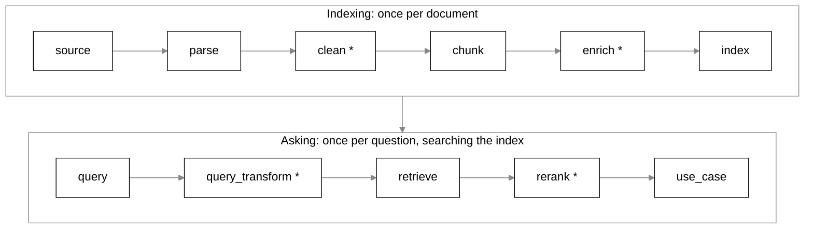

# RAG Playground

A local bench for learning how retrieval-augmented generation (RAG) works by trying it on
your own documents. Each stage of a RAG pipeline (parsing, cleaning, chunking, indexing,
retrieval, reranking and the final answer) is a strategy you can swap, run on its own and
inspect in the browser. You can also chain the stages into a full pipeline and compare
strategies side by side.

It runs entirely on your machine. The only network calls are the one-time model downloads
and, if you choose the chat answer, a call to Claude.

It is built for learning and demos, not for production: there is no auth, no multi-user
support and no scaling story.

## Contents

- [Quick start](#quick-start)
- [Run with Docker](#run-with-docker)
- [What you can do](#what-you-can-do)
- [Stages and supported strategies](#stages-and-supported-strategies)
- [Models and downloads](#models-and-downloads)
- [API key for chat answers](#api-key-for-chat-answers)
- [How it works](#how-it-works)
- [Adding a strategy](#adding-a-strategy)
- [Development](#development)
- [Where your data goes](#where-your-data-goes)

## Quick start

**You need:**

- Python 3.13 and [uv](https://docs.astral.sh/uv/). If you don't have Python 3.13, run
  `uv python install 3.13`.
- Node.js 22 or newer. It is used only to build the web UI once.
- About 2 GB of free disk space for the models, which download on first use.

**Install and run:**

```bash
git clone https://github.com/nadeem4/rag-playground.git
cd rag-playground

uv sync                               # Python dependencies
cd web && npm install && npm run build && cd ..   # build the web UI once

uv run rag-playground
```

The server starts on http://127.0.0.1:8000 and opens your browser. Options:

| Flag | Effect |
|---|---|
| `--port 8080` | Use another port. Without the flag, the `PORT` environment variable is used if set |
| `--host 0.0.0.0` | Listen on another interface. Without the flag, `RAG_PLAYGROUND_HOST` is used if set. No browser opens unless the host is `127.0.0.1`, `localhost` or `::1` |
| `--no-browser` | Don't open a browser tab |
| `--reload` | Restart the server when Python files change (for development) |

`--host 0.0.0.0` makes the playground reachable from other machines on your network. It has
no auth, so only do that on a network you trust.

**First steps in the UI:**

1. On **Build**, choose **Try the sample document** or upload a PDF.
   - The sample, `samples/chunking-primer.pdf`, is three pages of notes on chunking. It comes
     with a ready pipeline and a question, so pressing **Run all** shows every step working.
   - Choosing it also starts loading the Docling and Qwen3 models in the background.
   - To regenerate the sample, run `uv run python scripts/make_sample_pdf.py`.
2. Pick a parser and press **Run** on the Parse card. The inspector shows the text and the
   elements the parser found.
3. Add a cleaner, pick a chunker and run again. The chunk view draws every chunk boundary
   over the text.
4. Type a question in **Ask** and run through **Search** to see what retrieval finds.
5. Open **Compare** to run several chunkers, or several embedding sizes, side by side.

## Run with Docker

If you would rather not install Python and Node, Docker runs the whole thing:

```bash
docker compose up --build
```

Then open http://localhost:8000.

- **It takes a while the first time.** The build installs PyTorch (CPU only) and builds the
  UI, and the image is about 3.5 GB. The first run of each model also downloads it, which
  is another 1 to 2 GB.
- **Your models and uploads live in a named volume**, mounted at `/data` in the container.
  They survive `docker compose down` and rebuilds. To delete them, run
  `docker compose down -v`.
- **API key for chat answers:** put `ANTHROPIC_API_KEY=...` in a `.env` file next to
  `docker-compose.yml` (copy `.env.example`). Compose passes it to the container at start.
  It is never copied into the image, and the setup works without a `.env` at all.
- **Another port:** `RAG_PLAYGROUND_PORT=8080 docker compose up` serves the UI on
  http://localhost:8080.
- **Only your machine can reach it.** Compose publishes the port on `127.0.0.1`, because
  the playground has no login.

### Demo mode

For a public host that strangers share, such as a Hugging Face Space, set
`RAG_PLAYGROUND_DEMO=1`. The playground has no login, so demo mode switches off what is
unsafe to share:

- **No uploads.** `POST /api/sources` is refused, and the UI hides Upload. Visitors work with
  the bundled sample only, and no route lists or reads any other file, so nobody sees
  another visitor's document.
- **No server API key.** The key comes only from the request header, that is, a key the
  visitor types in the UI. `ANTHROPIC_API_KEY` in the environment or in `.env` is ignored,
  so visitors can never spend the host's key.

`GET /api/settings/app` returns `{"demo": true}` so the UI can say so.

## What you can do

- **Run any stage on its own and look at the result.** Every stage has an inspector:
  - parsed elements with their types and pages;
  - a diff of what each cleaner removed;
  - chunk boundaries drawn over the source text;
  - the index contents;
  - ranked retrieval hits.
- **Change one setting and rerun cheaply.** Results are cached by recipe, so changing the
  chunker never re-parses the PDF.
- **Compare strategies.** Sweep a stage over several strategies or settings and see the
  results side by side, including how many steps were reused from the cache.
- **Learn as you go.** Each card has an info button that explains what the step is for,
  how the chosen strategy works, and what it will do with your current settings, including
  the trade-off. Settings that make no sense show a warning and disable Run. After a run,
  the card says what the step did compared with the previous run.
- **Get answers with checked citations.** The chat step asks Claude to answer from the
  retrieved chunks only.
  - Every claim cites the exact passage it relied on.
  - Each citation is checked against the parsed document; one that does not match is
    marked unverified rather than trusted.
  - Clicking a citation opens the original PDF page with the sentence highlighted.
- **Show in PDF without a key.** Any chunk or search hit can open its PDF page with its
  source paragraphs outlined.

## Stages and supported strategies



`*` marks a stackable stage: its input and output have the same type, so you can add it
several times, for example two cleaners in a row.

| Stage | What it is for | Strategies |
|---|---|---|
| **source** | The document you work on | `upload` |
| **query** | The question you ask | `text` |
| **parse** | Turns the PDF into text elements (headings, paragraphs, lists, tables) with their pages and positions | `pdfium`, `docling` |
| **clean** \* | Removes text that would pollute retrieval, such as page numbers and repeated boilerplate | `header_footer_strip`, `dedupe_blocks`, `drop_matching` |
| **chunk** | Cuts the text into the pieces that get indexed and retrieved | `recursive_character`, `markdown_header`, `token_based` |
| **enrich** \* | Adds context to chunks before indexing | planned |
| **index** | Embeds the chunks and stores them for vector and keyword search | `lancedb` |
| **query_transform** \* | Rewrites the question before retrieval | planned |
| **retrieve** | Finds the chunks most relevant to the question and hands on a pool of candidates (20 by default) | `dense`, `bm25`, `hybrid_rrf` |
| **rerank** \* | Picks the best few from the retrieved candidates | `mmr` |
| **use_case** | What the user finally gets | `search`, `chat` |

### Parse

| Strategy | How it works | Good for |
|---|---|---|
| `pdfium` | Reads the text stored in the PDF in the order it was drawn. Every block is a plain paragraph, and a scanned page with no stored text comes out empty. | A fast baseline with no model |
| `docling` | Renders each page and runs a layout model that labels titles, headings, list items, tables, and page headers and footers, then fixes the reading order. | Real documents. It is the recommended parser. |

### Clean

| Strategy | How it works |
|---|---|
| `header_footer_strip` | Removes running heads, running feet and page numbers: short blocks that repeat at the top or bottom of pages. |
| `dedupe_blocks` | Removes a block that repeats an earlier one of the same kind, keeping the first copy. |
| `drop_matching` | Removes every block containing a pattern you name, as plain text or a regular expression. Use it for boilerplate the other cleaners miss. |

### Chunk

| Strategy | How it works |
|---|---|
| `recursive_character` | Cuts at paragraph breaks first, then at line breaks, sentence ends and spaces, and packs the parts up to the chunk size, with optional overlap. |
| `markdown_header` | One chunk per section: a heading and everything under it. Long sections are split between blocks. Needs a parser that detects headings. |
| `token_based` | Cuts every N tokens wherever that falls. A deliberately naive baseline. |

### Index, retrieve and rerank

| Stage | Strategy | How it works |
|---|---|---|
| index | `lancedb` | Embeds every chunk and stores it in a LanceDB table with a keyword index over the same rows. |
| retrieve | `dense` | Vector search: finds chunks whose meaning is closest to the question, including paraphrases. |
| retrieve | `bm25` | Keyword search: scores chunks by shared words, weighting rare words higher. Finds exact names and codes. |
| retrieve | `hybrid_rrf` | Runs both searches and merges the two rankings by position (reciprocal rank fusion). |
| rerank | `mmr` | Maximal Marginal Relevance: picks its top 5 from the retriever's pool of 20, trading a little relevance for variety, so it can drop near-duplicates instead of only reordering them. |

### Use case

| Strategy | How it works | Needs a key |
|---|---|---|
| `search` | Shows the top 5 chunks as a ranked list with scores and pages, and how many candidates there were. | No |
| `chat` | Claude answers from the top 5 retrieved chunks only, with a checked citation for every claim. | Yes |

## Models and downloads

Everything runs on CPU. Models download from Hugging Face into `~/.cache/huggingface` the
first time they are used, so the first run of a step is slow and later runs are fast.

| Model | Used by | Download | Notes |
|---|---|---|---|
| Docling layout models | `docling` parser | about 0.5 GB | About a second per page after the first run |
| `Qwen/Qwen3-Embedding-0.6B` | index (default embedder) | about 1.2 GB | 1024 dimensions. Supports Matryoshka truncation to 512, 256, 128 or 64 through `truncate_dim`. |
| `BAAI/bge-small-en-v1.5` | index (baseline embedder) | about 130 MB | 384 dimensions, no truncation |
| `fake-deterministic` | tests | none | A hashing embedder with no download, for tests and quick experiments |

Both real embedders are pinned to a Hugging Face commit. Embeddings are cached at full width
in SQLite, so re-indexing the same chunks, or sweeping `truncate_dim`, embeds each chunk once.

## API key for chat answers

Only the `chat` step needs an Anthropic API key. Everything else works without one. The
server looks for a key in three places and uses the first it finds:

1. **Typed in the UI.** Open **API key** at the top right, paste the key and choose Apply.
   The browser keeps it in memory for that tab only. It is never saved, and reloading the
   page clears it. **Check key** tests it without spending tokens.
2. **The `ANTHROPIC_API_KEY` environment variable of the server process:**

   ```bash
   ANTHROPIC_API_KEY=sk-ant-... uv run rag-playground            # bash
   $env:ANTHROPIC_API_KEY="sk-ant-..."; uv run rag-playground    # PowerShell, this window only
   ```

3. **A `.env` file** at the repo root. Copy `.env.example` to `.env` and fill in
   `ANTHROPIC_API_KEY=`. `.env` is gitignored. The server reads it without adding it to its
   own environment.

Don't set the key as a system-wide or user-wide environment variable. Every program you start
would inherit it, including AI coding tools that could then read and use it.

The server never stores, logs or returns the key, and it shows `[redacted]` in its place in
any error.

## How it works

The engine has two concepts and no `Pipeline` class:

- **Artifact.** An immutable result, such as a parsed document, a chunk set, an index or a
  set of retrieval hits. Its ID is a hash of its recipe: the transform, the transform's
  version, the model it used, its config and the IDs of its inputs.
- **Transform.** A strategy that turns typed input artifacts into one output artifact.

A pipeline is a graph of transforms. Because an artifact's ID is its recipe, the same step
with the same inputs is computed once and read from the cache after that. Sweeping three
chunkers over one parse is one cached parse and three new chunk sets.

```
core/        the engine: artifacts, transforms, graph, executor, content-addressed store
providers/   embedding models and the embedding cache
plugins/     one module per strategy, grouped by stage
api/         FastAPI server: registry, sources, runs (streamed as server-sent events), artifacts
web/         React UI: Build, Compare, inspectors
tests/       pytest: unit, plugin contract, API and integration tests
```

## Adding a strategy

A strategy is one Python module. The UI builds its settings form from the config model, so
a new strategy needs no frontend change.

1. Create `plugins/<stage>/<name>.py` with a Pydantic config model and a `Transform`
   subclass decorated with `@register`. Give the class:
   - a `summary` of how the strategy works;
   - an `explain(config)` that describes what these settings will do.
2. Add the module to `PLUGIN_MODULES` in `plugins/__init__.py`. A test fails if a plugin
   module exists but is not listed.
3. Run `uv run pytest`. The contract suite checks every plugin automatically, including:
   - determinism;
   - the cache key;
   - that the explanation changes with each setting.

Look at `plugins/clean/drop_matching.py` for a small, complete example.

## Development

```bash
uv sync --extra dev
uv run pytest                 # fast suite, no model downloads
uv run pytest -m models       # slow tests that load Docling, Qwen3 and bge
```

For the web UI:

```bash
cd web
npm install
npm run dev      # Vite on http://localhost:5173, proxies /api to 127.0.0.1:8000
npm test         # Vitest
npm run build    # writes web/dist, which the Python server serves
```

To work on the UI, run `uv run rag-playground --no-browser --reload` in one terminal and
`npm run dev` in another, then open http://localhost:5173.

**UI styling and fixtures:**
- Every colour, size and radius is a token in `web/src/styles/tokens.css`. Tailwind's
  default scales are cleared, so values that are not tokens do not compile.
- The **Dev** menu in the header opens the component inspectors and a token specimen page.
- The UI tests use JSON fixtures generated from the real engine. Regenerate them with
  `uv run python web/scripts/export_fixtures.py`.

## Where your data goes

| What | Where | Change it with |
|---|---|---|
| Uploaded files | `sources/` | `RAG_PLAYGROUND_SOURCES` |
| Cached results | `artifacts/` | `RAG_PLAYGROUND_ARTIFACTS` |
| Embedding cache | `artifacts/.embcache/` | `RAG_PLAYGROUND_EMBED_CACHE` |
| Models | `~/.cache/huggingface` | Hugging Face's `HF_HOME` |

`sources/`, `artifacts/` and `.env` are gitignored. **Clear cache** in the UI deletes the
cached results and the embedding cache. Nothing leaves your machine except model downloads
and, when you use `chat`, the question and retrieved chunks sent to Claude.
