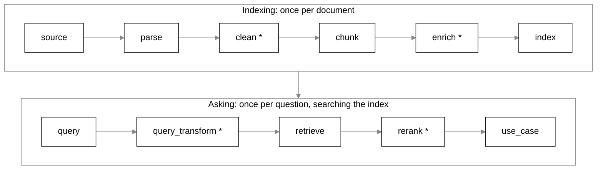

# RAG Playground

[Try the live demo](https://huggingface.co/spaces/nadeem4nk/rag-playground) | [Run your own copy](https://huggingface.co/spaces/nadeem4nk/rag-playground?duplicate=true) | [Run it locally](#quick-start)

A local bench for learning how retrieval-augmented generation (RAG) works by trying it on
your own documents. Each stage of a RAG pipeline (parsing, cleaning, chunking, indexing,
retrieval, reranking and the final answer) is a strategy you can swap, run on its own and
inspect in the browser. You can also chain the stages into a full pipeline and compare
strategies side by side.

It runs entirely on your machine. The only network calls are the one-time model downloads
and, if you choose the chat answer, a call to the chat model you pick: Claude, OpenAI, or
any OpenAI-compatible server (which can be a local one, such as Ollama).

It is built for learning and demos, not for production: there is no auth, no multi-user
support and no scaling story.

## Contents

- [Quick start](#quick-start)
- [Run with Docker](#run-with-docker)
- [What you can do](#what-you-can-do)
- [Lessons](#lessons)
- [Stages and supported strategies](#stages-and-supported-strategies)
- [Models and downloads](#models-and-downloads)
- [API keys for chat answers](#api-keys-for-chat-answers)
- [How it works](#how-it-works)
- [Adding a strategy](#adding-a-strategy)
- [Releases](#releases)
- [Development](#development)
- [Where your data goes](#where-your-data-goes)

The live demo runs in demo mode: it uses the bundled sample document, uploads are turned off, and
it never uses a key of ours, so chat answers need your own key typed into the app. Duplicate the Space
or run it locally to use your own PDFs.

## Quick start

**You need:**

- Python 3.13 and [uv](https://docs.astral.sh/uv/). If you don't have Python 3.13, run
  `uv python install 3.13`.
- Node.js 22 or newer. It is used only to build the web UI once.
- About 2 GB of free disk space for the models, which download on first use.

**Install and run:**

```bash
git clone https://github.com/nadeem4/rag-playground.git
cd rag-playground

uv sync                               # Python dependencies
cd web && npm install && npm run build && cd ..   # build the web UI once

uv run rag-playground
```

The server starts on http://127.0.0.1:8000 and opens your browser. Options:

| Flag | Effect |
|---|---|
| `--port 8080` | Use another port. Without the flag, the `PORT` environment variable is used if set |
| `--host 0.0.0.0` | Listen on another interface. Without the flag, `RAG_PLAYGROUND_HOST` is used if set. No browser opens unless the host is `127.0.0.1`, `localhost` or `::1` |
| `--no-browser` | Don't open a browser tab |
| `--reload` | Restart the server when Python files change (for development) |

`--host 0.0.0.0` makes the playground reachable from other machines on your network. It has
no auth, so only do that on a network you trust.

**First steps in the UI:**

The playground opens on **Lessons** (`/`): three short lessons on the sample PDF, in order.
The first one follows one question through a recorded real run of the pipeline, from the
answer back to the PDF. Your progress is kept in your browser. To work on your own
document, open **Build** (`/build`):

1. On **Build**, choose **Try the sample document** or upload a PDF.
   - The sample, `samples/chunking-primer.pdf`, is three pages of notes on chunking. It comes
     with a ready pipeline and a question, so pressing **Run all** shows every step working.
   - Choosing it also starts loading the Docling and Qwen3 models in the background.
   - To regenerate the sample, run `uv run python scripts/make_sample_pdf.py`.
   - The end-to-end lesson reads `web/src/learn/e2e-run.json`. To record it again after a
     change to the pipeline, run `uv run python scripts/record_e2e_lesson.py` (it needs the
     Docling and Qwen3 models).
   - `uv run python scripts/record_chunking_comparison.py` measures how the three chunkers
     compare on the sample: where each one cuts, and how each scores against
     `samples/questions.json`. It writes `web/src/learn/chunking-strategies.json`, which a
     lesson being written will use.
2. Pick a parser and press **Run** on the Parse card. The inspector shows the text and the
   elements the parser found.
3. Add a cleaner, pick a chunker and run again. The chunk view draws every chunk boundary
   over the text.
4. Type a question in **Ask** and run through **Search** to see what retrieval finds.
5. Open **Compare** to run several chunkers, or several embedding sizes, side by side.

## Run with Docker

If you would rather not install Python and Node, Docker runs the whole thing:

```bash
docker compose up --build
```

Then open http://localhost:8000.

- **It takes a while the first time.** The build installs PyTorch (CPU only) and builds the
  UI, and the image is about 3.6 GB. The first run of each model also downloads it, which
  is another 1 to 2 GB.
- **Your models and uploads live in a named volume**, mounted at `/data` in the container.
  They survive `docker compose down` and rebuilds. To delete them, run
  `docker compose down -v`.
- **API keys for chat answers:** put `ANTHROPIC_API_KEY=...`, `OPENAI_API_KEY=...` or
  `OPENAI_COMPATIBLE_API_KEY=...` in a `.env` file next to `docker-compose.yml` (copy
  `.env.example`). Compose passes them to the container at start. They are never copied
  into the image, and the setup works without a `.env` at all.
- **Another port:** `RAG_PLAYGROUND_PORT=8080 docker compose up` serves the UI on
  http://localhost:8080.
- **Only your machine can reach it.** Compose publishes the port on `127.0.0.1`, because
  the playground has no login.

### Demo mode

For a public host that strangers share, such as a Hugging Face Space, set
`RAG_PLAYGROUND_DEMO=1`. The playground has no login, so demo mode switches off what is
unsafe to share:

- **No uploads.** `POST /api/sources` is refused, and the UI hides Upload. Visitors work with
  the bundled sample only, and no route lists or reads any other file, so nobody sees
  another visitor's document.
- **No server API keys.** Every key, for every provider, comes only from the request
  header, that is, a key the visitor types in the UI. `ANTHROPIC_API_KEY`,
  `OPENAI_API_KEY` and `OPENAI_COMPATIBLE_API_KEY` in the environment or in `.env` are
  ignored, so visitors can never spend the host's keys.
- **No custom endpoints.** A run or sweep with a chat node set to the `custom` model is
  refused with 403, and so is checking a custom endpoint: the server would otherwise send
  a request to any URL a visitor chose.

`GET /api/settings/app` returns `{"demo": true}` so the UI can say so.

## What you can do

- **Run any stage on its own and look at the result.** Every stage has an inspector:
  - parsed elements with their types and pages;
  - a diff of what each cleaner removed;
  - chunk boundaries drawn over the source text;
  - the index contents;
  - ranked retrieval hits.
- **Change one setting and rerun cheaply.** Results are cached by recipe, so changing the
  chunker never re-parses the PDF.
- **Compare strategies.** Sweep a stage over several strategies or settings and see the
  results side by side, including how many steps were reused from the cache.
- **Score a pipeline instead of guessing.** The Evaluate page takes the pipeline you built,
  asks it every question in the bundled question set, and says how many of them found their
  answer, at what rank, and in which chunk. Each question carries the sentence in the
  document that answers it, so a run counts as a hit when a retrieved chunk contains that
  sentence. A row opens to show the chunks that came back, so a miss can be understood. The
  previous score of the tab is kept, so after changing one setting the page reads "4 of 10,
  was 10 of 10" and marks the questions that changed. It needs no API key.
- **Bring your own questions.** The bundled question set is about the bundled sample, so
  scoring your own PDF against it would be meaningless. Download the template
  ([`GET /api/questions/template?format=json`](http://127.0.0.1:8000/api/questions/template?format=json),
  or `format=csv` for a spreadsheet), fill in your questions with the sentences from your
  document that answer them, and upload the file on the Evaluate page. It is stored against
  that document's fingerprint, so a set can never be scored against the wrong document. Each
  gold passage must be **copied from the document, not retyped**: the upload check looks for
  every one of them in the document's own text and tells you which were not there, with the
  closest passage it did find, so a stray curly quote or a typo shows up at once instead of
  looking like a retrieval failure. A question may carry several gold passages when the
  document answers it in more than one place; any of them counts.
- **Learn as you go.** Each card has an info button that explains what the step is for,
  how the chosen strategy works, and what it will do with your current settings, including
  the trade-off. Settings that make no sense show a warning and disable Run. After a run,
  the card says what the step did compared with the previous run.
- **Get answers with checked citations, from any model.** The chat step asks Claude, an
  OpenAI model, or any OpenAI-compatible server to answer from the retrieved chunks only.
  - Every claim cites the exact passage it relied on. Claude can use its own citations
    feature; every model can cite by sentence ids, where each retrieved sentence gets an
    id, the model writes the ids after each claim, and the playground quotes those
    sentences itself.
  - With sentence ids, each claim is compared with the sentences it cites using the
    index's embedder, and is shown as cited, weak (the cited sentences do not match it
    well), matched by similarity (it cited nothing, but a shown sentence matches it), or
    not grounded.
  - Each citation is checked against the parsed document; one that does not match is
    marked unverified rather than trusted.
  - Clicking a citation opens the original PDF page with the sentence highlighted.
- **Show in PDF without a key.** Any chunk or search hit can open its PDF page with its
  source paragraphs outlined.

## Lessons

The playground opens on **Lessons**. Each one is a few short steps, with the sample document
beside you the whole time, and ends with a recap.

| Lesson | What you do |
|---|---|
| **How RAG works, end to end** | Follow one question from the answer back to the PDF, one pipeline step at a time, through a recorded real run |
| **Chunking** | Predict what a setting will do to one sentence, then watch the real chunker prove you right or wrong |
| **How citations work** | Step through how any model can point at the exact sentence it used, and how an invented citation is caught |

Your progress is kept in your browser, so finished lessons are marked and the page offers the
next one.

**Learn mode**, the switch in the header, changes the **Build** page only. With it on, every
setting carries a short explanation, and each step says what it just did. Turn it off for a
clean workbench.

## Stages and supported strategies



`*` marks a stackable stage: its input and output have the same type, so you can add it
several times, for example two cleaners in a row.

| Stage | What it is for | Strategies |
|---|---|---|
| **source** | The document you work on | `upload` |
| **query** | The question you ask, and optionally the sentence or sentences in the document that answer it | `text` |
| **parse** | Turns the PDF into text elements (headings, paragraphs, lists, tables) with their pages and positions | `pdfium`, `docling` |
| **clean** \* | Removes text that would pollute retrieval, such as page numbers and repeated boilerplate | `header_footer_strip`, `dedupe_blocks`, `drop_matching` |
| **chunk** | Cuts the text into the pieces that get indexed and retrieved | `recursive_character`, `markdown_header`, `token_based` |
| **enrich** \* | Adds context to chunks before indexing | planned |
| **index** | Embeds the chunks and stores them for vector and keyword search | `lancedb` |
| **query_transform** \* | Rewrites the question before retrieval | planned |
| **retrieve** | Finds the chunks most relevant to the question and hands on a pool of candidates (20 by default) | `dense`, `bm25`, `hybrid_rrf` |
| **rerank** \* | Picks the best few from the retrieved candidates | `mmr` |
| **use_case** | What the user finally gets | `search`, `chat`, `eval` |

### Parse

| Strategy | How it works | Good for |
|---|---|---|
| `pdfium` | Reads the text stored in the PDF in the order it was drawn. Every block is a plain paragraph, and a scanned page with no stored text comes out empty. | A fast baseline with no model |
| `docling` | Renders each page and runs a layout model that labels titles, headings, list items, tables, and page headers and footers, then fixes the reading order. | Real documents. It is the recommended parser. |

### Clean

| Strategy | How it works |
|---|---|
| `header_footer_strip` | Removes running heads, running feet and page numbers: short blocks that repeat at the top or bottom of pages. |
| `dedupe_blocks` | Removes a block that repeats an earlier one of the same kind, keeping the first copy. |
| `drop_matching` | Removes every block containing a pattern you name, as plain text or a regular expression. Use it for boilerplate the other cleaners miss. |

### Chunk

| Strategy | How it works |
|---|---|
| `recursive_character` | Cuts at paragraph breaks first, then at line breaks, sentence ends and spaces, and packs the parts up to the chunk size, with optional overlap. |
| `markdown_header` | One chunk per section: a heading and everything under it. Long sections are split between blocks. Needs a parser that detects headings. |
| `token_based` | Cuts every N tokens wherever that falls. A deliberately naive baseline. |

### Index, retrieve and rerank

| Stage | Strategy | How it works |
|---|---|---|
| index | `lancedb` | Embeds every chunk and stores it in a LanceDB table with a keyword index over the same rows. |
| retrieve | `dense` | Vector search: finds chunks whose meaning is closest to the question, including paraphrases. |
| retrieve | `bm25` | Keyword search: scores chunks by shared words, weighting rare words higher. Finds exact names and codes. |
| retrieve | `hybrid_rrf` | Runs both searches and merges the two rankings by position (reciprocal rank fusion). |
| rerank | `mmr` | Maximal Marginal Relevance: picks its top 5 from the retriever's pool of 20, trading a little relevance for variety, so it can drop near-duplicates instead of only reordering them. |

### Use case

| Strategy | How it works | Needs a key |
|---|---|---|
| `search` | Shows the top 5 chunks as a ranked list with scores and pages, and how many candidates there were. | No |
| `chat` | A chat model (Claude, OpenAI, or a custom OpenAI-compatible endpoint) answers from the top 5 retrieved chunks only, and every claim points at the sentences it relied on. `citation_method` is `auto` (Claude's own citations for a Claude model, sentence ids for any other) or `sentence_ids`. With sentence ids, `support_threshold` (0.55) decides when a claim counts as cited rather than weak. | Yes, for the chosen provider; optional for a custom endpoint |
| `eval` | Checks whether the top 5 retrieved chunks contain the sentence that answers the question, and reports hit or miss, the rank it was found at, and which chunk it was in. The question carries that sentence as its `gold_answer`, so one sweep over a set of questions scores a whole configuration. A question may also carry several sentences in `gold_answers`, any of which counts, and the report says how many of them were found. | No |

## Models and downloads

Everything runs on CPU. Models download from Hugging Face into `~/.cache/huggingface` the
first time they are used, so the first run of a step is slow and later runs are fast.

| Model | Used by | Download | Notes |
|---|---|---|---|
| Docling layout models | `docling` parser | about 0.5 GB | About a second per page after the first run |
| RapidOCR PP-OCRv6 | `docling` parser with `do_ocr` on | none | The ONNX checkpoints ship inside the `rapidocr` package, so OCR downloads nothing. Several seconds per page |
| `Qwen/Qwen3-Embedding-0.6B` | index (default embedder) | about 1.2 GB | 1024 dimensions. Supports Matryoshka truncation to 512, 256, 128 or 64 through `truncate_dim`. |
| `BAAI/bge-small-en-v1.5` | index (baseline embedder) | about 130 MB | 384 dimensions, no truncation |
| `fake-deterministic` | tests | none | A hashing embedder with no download, for tests and quick experiments |

Both real embedders are pinned to a Hugging Face commit. Embeddings are cached at full width
in SQLite, so re-indexing the same chunks, or sweeping `truncate_dim`, embeds each chunk once.

## API keys for chat answers

Only the `chat` step needs a key, and only for the provider of the model it uses.
Everything else works without one.

| Provider | Models | Header the UI sends | Environment variable and `.env` entry |
|---|---|---|---|
| Anthropic | Claude Opus 5, Sonnet 5, Haiku 4.5 | `X-Anthropic-Api-Key` | `ANTHROPIC_API_KEY` |
| OpenAI | GPT-6 Astra, GPT-5.6 Sol, GPT-5.6 Luna | `X-OpenAI-Api-Key` | `OPENAI_API_KEY` |
| Custom endpoint | any model on an OpenAI-compatible server (set `custom_base_url` and `custom_model` on the chat node) | `X-Custom-Api-Key` | `OPENAI_COMPATIBLE_API_KEY` |

The custom endpoint's key is optional: a local server such as Ollama
(`http://localhost:11434/v1`) usually needs none. A missing key for any other provider fails
the chat node with a message naming the key.

For each provider, the server looks for its key in three places and uses the first it
finds:

1. **Typed in the UI.** Open **API key** at the top right. The panel has one row per
   provider: Anthropic, OpenAI, and Custom endpoint (optional, since a local server may
   need no key). Paste a key into its row and choose Apply. The browser keeps each key in
   memory for that tab only. It is never saved, and reloading the page clears it. The
   Anthropic and OpenAI rows have **Check key**, which tests that key without spending
   tokens. A custom endpoint's key is checked when chat runs against it.
2. **The provider's environment variable in the server process,** for example:

   ```bash
   ANTHROPIC_API_KEY=sk-ant-... uv run rag-playground            # bash
   $env:ANTHROPIC_API_KEY="sk-ant-..."; uv run rag-playground    # PowerShell, this window only
   ```

3. **A `.env` file** at the repo root. Copy `.env.example` to `.env` and fill in the keys
   you need. `.env` is gitignored. The server reads it without adding it to its own
   environment.

Don't set a key as a system-wide or user-wide environment variable. Every program you start
would inherit it, including AI coding tools that could then read and use it.

### What happens to a key you type in

The key stays in that tab's memory. It is sent as a request header with each run, sweep and
key check, and with nothing else. It is never written to disk, never logged, never put in a
URL, and never returned by any endpoint. Closing the tab or reloading the page clears it,
and nothing brings it back.

Two honest limits. First, while the tab is open the key is in the browser's memory, so
anything that can reach that page can read it: a browser extension you installed, the React
developer tools, or a person at your keyboard. That is true of any web app you paste a key
into. Second, a key in `.env` is on disk, because you put it there. Only you can take it
off disk again, by deleting the file.

The server never stores, logs or returns a key, and it shows `[redacted]` in its place in
any error. `GET /api/settings/llm` reports only which source the server itself has for
each provider, as `{"anthropic": ..., "openai": ..., "custom": ...}` with `env`, `dotenv`
or `none`. `POST /api/settings/llm/check` with `{"provider": "anthropic" | "openai" |
"custom"}` tests one key with a model listing, which costs no tokens; a custom check also
needs `"base_url"`.

## How it works

The engine has two concepts and no `Pipeline` class:

- **Artifact.** An immutable result, such as a parsed document, a chunk set, an index or a
  set of retrieval hits. Its ID is a hash of its recipe: the transform, the transform's
  version, the model it used, its config and the IDs of its inputs.
- **Transform.** A strategy that turns typed input artifacts into one output artifact.

A pipeline is a graph of transforms. Because an artifact's ID is its recipe, the same step
with the same inputs is computed once and read from the cache after that. Sweeping three
chunkers over one parse is one cached parse and three new chunk sets.

```
core/        the engine: artifacts, transforms, graph, executor, content-addressed store
providers/   embedding models and the embedding cache
plugins/     one module per strategy, grouped by stage
api/         FastAPI server: registry, sources, runs (streamed as server-sent events), artifacts
web/         React UI: Lessons, Build, Compare, Evaluate, inspectors
samples/     the sample PDF and the question set the Evaluate page scores against
scripts/     regenerate the sample, record a lesson, publish the demo Space
tests/       pytest: unit, plugin contract, API and integration tests
```

## Adding a strategy

A strategy is one Python module. The UI builds its settings form from the config model, so
a new strategy needs no frontend change.

1. Create `plugins/<stage>/<name>.py` with a Pydantic config model and a `Transform`
   subclass decorated with `@register`. Give the class:
   - a `summary` of how the strategy works;
   - an `explain(config)` that describes what these settings will do;
   - for a chunk strategy, `learn`: a one-sentence `hint` and more paragraphs for the
     strategy itself (the key `_strategy`) and for every setting. Learn mode shows them.
2. Add the module to `PLUGIN_MODULES` in `plugins/__init__.py`. A test fails if a plugin
   module exists but is not listed.
3. Run `uv run pytest`. The contract suite checks every plugin automatically, including:
   - determinism;
   - the cache key;
   - that the explanation changes with each setting;
   - for a chunk strategy, that `learn` covers every setting in full sentences, with no
     dashes.

Look at `plugins/clean/drop_matching.py` for a small, complete example.

## Releases

The tests run on every push and pull request to `main`. The hosted demo moves only when a
version tag is pushed:

```bash
git tag v0.1.0
git push origin v0.1.0
```

That republishes the Hugging Face Space from the tagged code. It needs a repository secret
named `HF_TOKEN`, a Hugging Face token with write access. You can also publish by hand with
`uv run python scripts/publish_space.py --repo <user>/rag-playground`.

## Development

```bash
uv sync --extra dev
uv run pytest                 # fast suite, no model downloads
uv run pytest -m models       # slow tests that load Docling, Qwen3 and bge
```

For the web UI:

```bash
cd web
npm install
npm run dev      # Vite on http://localhost:5173, proxies /api to 127.0.0.1:8000
npm test         # Vitest
npm run build    # writes web/dist, which the Python server serves
```

To work on the UI, run `uv run rag-playground --no-browser --reload` in one terminal and
`npm run dev` in another, then open http://localhost:5173.

**UI styling and fixtures:**
- Every colour, size and radius is a token in `web/src/styles/tokens.css`. Tailwind's
  default scales are cleared, so values that are not tokens do not compile.
- The **Dev** menu in the header opens the component inspectors and a token specimen page.
- The two typefaces, Atkinson Hyperlegible Next for reading and Martian Mono for data, are
  self-hosted from npm. No font is fetched from the network at run time.
- The UI tests use JSON fixtures generated from the real engine. Regenerate them with
  `uv run python web/scripts/export_fixtures.py`.

## Where your data goes

| What | Where | Change it with |
|---|---|---|
| Uploaded files | `sources/` | `RAG_PLAYGROUND_SOURCES` |
| Question sets you upload | `sources/questions/<fingerprint>.json` | `RAG_PLAYGROUND_SOURCES` |
| Cached results | `artifacts/` | `RAG_PLAYGROUND_ARTIFACTS` |
| Embedding cache | `artifacts/.embcache/` | `RAG_PLAYGROUND_EMBED_CACHE` |
| Models | `~/.cache/huggingface` | Hugging Face's `HF_HOME` |

Your browser also keeps three small things of its own: which lessons you have finished, the
Learn mode switch, and the last Evaluate score of the tab. Clearing your browser data removes
them, and they never leave your machine.

A key typed into the app is in none of these places. It stays in the browser tab's memory
and is gone when the tab closes. See
[What happens to a key you type in](#what-happens-to-a-key-you-type-in).

`sources/`, `artifacts/` and `.env` are gitignored. **Clear cache** in the UI deletes the
cached results and the embedding cache. Nothing leaves your machine except model downloads
and, when you use `chat`, the question and retrieved chunks sent to the chat model's
provider (Anthropic, OpenAI, or the custom endpoint you set).
