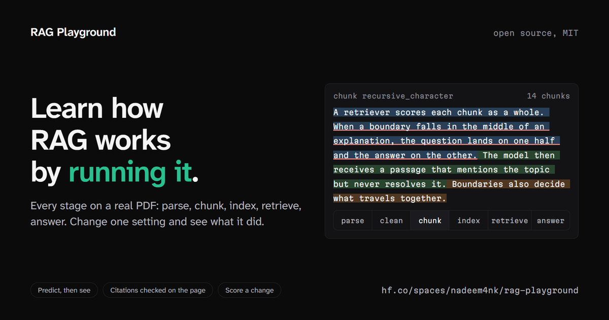
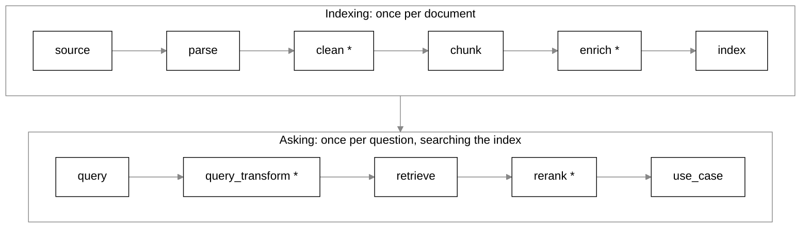

# RAG Playground

[Try the live demo](https://huggingface.co/spaces/nadeem4nk/rag-playground) | [Run your own copy](https://huggingface.co/spaces/nadeem4nk/rag-playground?duplicate=true) | [Run it locally](#quick-start)



A local bench for learning how retrieval-augmented generation (RAG) works by trying it on
your own documents. Each stage of a RAG pipeline (parsing, cleaning, chunking, indexing,
retrieval, reranking and the final answer) is a strategy you can swap, run on its own and
inspect in the browser. You can also chain the stages into a full pipeline and compare
strategies side by side.

It runs entirely on your machine. The only network calls are the one-time model downloads
and, if you choose the chat answer, a call to the chat model you pick: Claude, OpenAI, or
any OpenAI-compatible server (which can be a local one, such as Ollama).

It is built for learning and demos, not for production: there is no auth, no multi-user
support and no scaling story.

## Contents

- [Quick start](#quick-start)
- [Run with Docker](#run-with-docker)
- [Home](#home)
- [What you can do](#what-you-can-do)
- [Lessons](#lessons)
- [Stages and supported strategies](#stages-and-supported-strategies)
- [Models and downloads](#models-and-downloads)
- [API keys for chat answers](#api-keys-for-chat-answers)
- [How it works](#how-it-works)
- [Adding a strategy](#adding-a-strategy)
- [Releases](#releases)
- [Development](#development)
- [Where your data goes](#where-your-data-goes)

The live demo runs in demo mode: the bundled samples are there for everyone, a PDF you upload
stays private to your browser and is deleted after a day (up to 10 MB and 20 pages), and it
never uses a key of ours, so chat answers need your own key typed into the app. Everything
else works without a key. Run it locally for larger files or to keep your uploads.

## Quick start

**You need:**

- Python 3.13 and [uv](https://docs.astral.sh/uv/). If you don't have Python 3.13, run
  `uv python install 3.13`.
- Node.js 22 or newer. It is used only to build the web UI once.
- About 2 GB of free disk space for the models, which download on first use.

**Install and run:**

```bash
git clone https://github.com/nadeem4/rag-playground.git
cd rag-playground

uv sync                               # Python dependencies
cd web && npm install && npm run build && cd ..   # build the web UI once

uv run rag-playground
```

The server starts on http://127.0.0.1:8000 and opens your browser. Options:

| Flag | Effect |
|---|---|
| `--port 8080` | Use another port. Without the flag, the `PORT` environment variable is used if set |
| `--host 0.0.0.0` | Listen on another interface. Without the flag, `RAG_PLAYGROUND_HOST` is used if set. No browser opens unless the host is `127.0.0.1`, `localhost` or `::1` |
| `--no-browser` | Don't open a browser tab |
| `--reload` | Restart the server when Python files change (for development) |

`--host 0.0.0.0` makes the playground reachable from other machines on your network. It has
no auth, so only do that on a network you trust.

**First steps in the UI:**

The playground opens on **Home** (`/`). It says what the playground shows and gives Build,
Compare and Evaluate a section each, with a short clip of the page. Each **Try it yourself**
button opens its page with the first sample already loaded, so the first click runs something
real. If you already have a document, it is kept. See [Home](#home).

The column on the left of **Build** is the index pipeline: Upload, Parse, Clean, Chunk and
Index, one card each with its own settings. **Build the index** runs those five steps, and
selecting a card shows its output on the right, with **Back to Ask** to return.

The Ask panel on the right holds the question and the retrieval, rerank and answer
settings, summed up in one recipe line. **Ask** runs the question against the index and
shows the ranked pieces, the search order against the reranked order when a reranker is
on, a written answer when the answer is Chat, and the questions asked earlier in the tab.
The rerank is drawn as a slope between the search order and the reranked order: one
line per kept piece, rising in the accent and falling in grey. On a phone or tablet the
reranked list comes first and the search order folds under Show search order.
The **Rewrite** control in the Retrieval block can widen the keyword search with words
borrowed from the top dense hits (PRF, no key) or have a model restate the question in
the document's words (LLM, needs a key); a **Searched for** line under the question then
shows what retrieval searched with, while the answer still uses the question as typed.

1. Pick a document in the **Document** control at the top of every page: one of the samples,
   one of your uploads, or **Upload a PDF**. On a first visit Build also lists the samples
   with a Load button each. Every page uses this one document.
   - The sample, `samples/chunking-primer/chunking-primer.pdf`, is three pages of notes on
     chunking. It comes with a ready pipeline and a question, so pressing **Build the index**
     and then **Ask** in the Ask panel shows every step working.
   - Choosing it also starts loading the Docling and Qwen3 models in the background.
   - To regenerate the sample set, run `uv run python scripts/make_samples.py`, which writes
     every sample under `samples/<name>/`.
   - The end-to-end lesson reads `web/src/learn/e2e-run.json`. To record it again after a
     change to the pipeline, run `uv run python scripts/record_e2e_lesson.py` (it needs the
     Docling and Qwen3 models).
   - `uv run python scripts/record_chunking_comparison.py` measures how the three chunkers
     compare on the sample: where each one cuts, and how each scores against
     `samples/chunking-primer/questions.json`. It writes
     `web/src/learn/chunking-strategies.json`, which a lesson being written will use.
2. Pick a parser and press **Run** on the Parse card. The inspector shows the text and the
   elements the parser found.
3. Add a cleaner, pick a chunker and run again. The chunk view draws every chunk boundary
   over the text.
4. Type a question in the Ask panel, pick a reranker, and press **Ask** to see what
   retrieval finds and how the reranker reorders it.
5. Open **Compare** to run several chunkers or searches, up to ten, and read them side by side.

## Run with Docker

If you would rather not install Python and Node, Docker runs the whole thing:

```bash
docker compose up --build
```

Then open http://localhost:8000.

- **It takes a while the first time.** The build installs PyTorch (CPU only) and builds the
  UI, and the image is about 3.6 GB. The first run of each model also downloads it, which
  is another 1 to 2 GB.
- **Your models and uploads live in a named volume**, mounted at `/data` in the container.
  They survive `docker compose down` and rebuilds. To delete them, run
  `docker compose down -v`.
- **API keys for chat answers:** put `ANTHROPIC_API_KEY=...`, `OPENAI_API_KEY=...` or
  `OPENAI_COMPATIBLE_API_KEY=...` in a `.env` file next to `docker-compose.yml` (copy
  `.env.example`). Compose passes them to the container at start. They are never copied
  into the image, and the setup works without a `.env` at all.
- **Another port:** `RAG_PLAYGROUND_PORT=8080 docker compose up` serves the UI on
  http://localhost:8080.
- **Only your machine can reach it.** Compose publishes the port on `127.0.0.1`, because
  the playground has no login.

### Demo mode

For a public host that strangers share, such as a Hugging Face Space, set
`RAG_PLAYGROUND_DEMO=1`. The playground has no login, so demo mode switches off what is
unsafe to share:

- **Private, bounded uploads.** The server gives each browser an anonymous `rag_visitor`
  cookie. An upload belongs to that browser: no other visitor can list it, see its pages or run
  on it. Uploads are limited to 10 MB, 20 pages and 3 live files per browser, PDFs only, and are
  deleted a day after upload. The bundled samples stay public. Clearing cookies loses access to
  your uploads.
- **No server API keys.** Every key, for every provider, comes only from the request
  header, that is, a key the visitor types in the UI. `ANTHROPIC_API_KEY`,
  `OPENAI_API_KEY` and `OPENAI_COMPATIBLE_API_KEY` in the environment or in `.env` are
  ignored, so visitors can never spend the host's keys.
- **No custom endpoints.** A run or sweep with a chat node set to the `custom` model is
  refused with 403, and so is checking a custom endpoint: the server would otherwise send
  a request to any URL a visitor chose.

`GET /api/settings/app` returns `{"demo": true, "limits": {...}}` so the UI can say so and state the limits.

## Home

Home (`/`) is the first tab. It has:

- the promise, a **Try it on a sample** button and three facts: no sign in, samples or your
  own PDF, and a key only for chat answers;
- the six steps you can look inside, from Document to Ask;
- one section each for **Build**, **Compare** and **Evaluate**, with a short clip and a
  **Try it yourself** button. With no document yet, the button loads the first sample, then
  opens the page;
- links to **Read**, running it on your machine and the source, and a footer.

The clips are muted and loop. Each has a Pause and Play button, and with reduced motion
turned on they hold still on their poster until you press Play. Any path the app does not know
opens Home. The link to the source on GitHub is on Home, in the links row and the footer, so the
header keeps its width for the Document control.

The clips are recorded from a real session by a script. See [Recording the Home
clips](#recording-the-home-clips).

## What you can do

- **Run any stage on its own and look at the result.** Every stage has an inspector:
  - parsed elements with their types and pages;
  - a diff of what each cleaner removed;
  - chunk boundaries drawn over the source text;
  - the index contents;
  - ranked retrieval hits.
- **Start from a sample that shows one problem.** Four small PDFs are bundled, each written
  for this playground and generated by `scripts/make_samples.py`, so they are reproducible
  and free to share. Pick one in the Document control at the top of any page.

  | Sample | Pages | What it shows |
  |---|---|---|
  | A primer on chunking | 3 | Headings, a running footer and a repeated paragraph. The default, and the one the lessons use. |
  | Scanned notes | 2 | Pictures of text with no text layer. Without OCR the parse is empty. |
  | Two-column report | 2 | Rows drawn across both columns. A plain parser joins halves of different sentences. |
  | Table of figures | 2 | Answers in a ruled table. A plain parser loses the row labels; the heading chunker keeps the table whole. |

  Each sample has its own question set, so Evaluate scores the sample you loaded.
- **One document for every page.** The Document control in the header names the document Build,
  Compare and Evaluate all use, and opens a menu of the samples, your uploads and Upload a PDF.
  When a saved upload has expired, or is not in this browser, the control turns amber and reads
  Missing with the filename. Build, Compare and Evaluate then say so in one note with a Pick a
  document button, and their run buttons wait, saying "Needs a document." Choosing another
  document marks the results on the page out of date, as an edited step does; Evaluate opens a
  fresh evaluation for it. Build keeps a slim Document card that only says which document is in use.
- **Change one setting and rerun cheaply.** Results are cached by recipe, so changing the
  chunker never re-parses the PDF.
- **Compare strategies.** On the Compare page you pick a step, Parse, Chunk or Retrieve,
  and run up to ten recipes of it. Before the run each recipe is a card of the same size: the
  recipe as a sentence, and you change a setting by tapping its value, which opens one small
  editor under it. Add a recipe from a few suggestions or from defaults; ten is the most one
  run takes, and the server holds to the same cap. A sentence above the cards says what the run
  is about to show and how the results will open. During the run each recipe says whether it
  is waiting, running (with the seconds your browser counted) or finished, and Stop the run
  ends it. A recipe that fails says at which step and why, with Change this recipe, while the
  others finish. Three recipes or fewer open as columns side by side (one at a time below
  820 px), with a sentence that says what differs, such as "Halving the size doubles the
  pieces, from 6 to 12." Four or more open as a table you can sort by each number (a list
  with Sort by on a narrow screen), with a sentence that names the extremes. From the table
  you open one recipe beside your pipeline, or tick up to three to read side by side, then
  step through the rest with Previous and Next; the browser's Back button returns to the
  table. The page says "the answer" only when the question is one of the sample's own; with
  any other question the Answer column is hidden. Save experiment keeps the step, the recipes
  and the document by name in this browser, without results, and Your experiments opens one
  again. Use on Build puts a finished recipe on your pipeline. The Sweep button on a Build
  card opens Compare on that card, and Compare searches in the Ask panel opens it on
  Retrieve, with the question it answers shown at the top.
- **Save and share pipelines.** Name the pipeline on Build and keep it; switch between saved
  pipelines from the bar under the Index pipeline header of the column, and edit any of them. Once a
  pipeline is saved, Copy link puts the whole configuration in a URL: whoever opens it gets the pipeline on their Build page, and if it was
  built on a bundled sample, Build the index and Ask work at once. A pipeline carries its document, so loading
  a saved pipeline or opening a link changes the Document control too. Your own uploads do not travel with the
  link: the control reads Missing, and picking a sample keeps every shared setting. A run the server refuses
  shows in the run strip too. Pipelines live in your browser.
- **Score a pipeline instead of guessing.** The Evaluate page takes the pipeline on Build, or
  any saved pipeline you pick, scored on the document in the Document control, asks it every
  question in the loaded sample's question set, and
  says how many of them found their answer, at what rank, and in which chunk. Each question
  carries the sentence in the document that answers it, so a run counts as a hit when a
  retrieved chunk contains that sentence. The score reads as a sentence with the last run beside
  it ("3 of 5 questions found the answer. The last run found 5 of 5."), and the line under it
  names what changed when one step did ("Both misses are new since Parse changed to Fast text.").
  One mark per question sits under the score, and pressing a mark jumps to its row. Each row says
  its verdict in a word and why in a sentence ("Not in any of the 6 pieces that came back, so no
  number of pieces checked would find it."). An open row shows the sentence that answers the
  question and the top three pieces that came back, so a miss can be understood. The previous
  score of each pipeline in this tab is kept. It needs no API key.
- **Bring your own questions.** The bundled question sets are about the bundled samples, so
  scoring your own PDF against one of them would be meaningless. Download the template
  ([`GET /api/questions/template?format=json`](http://127.0.0.1:8000/api/questions/template?format=json),
  or `format=csv` for a spreadsheet), fill in your questions with the sentences from your
  document that answer them, and upload the file on the Evaluate page. It is stored against
  that document's fingerprint, so a set can never be scored against the wrong document. Each
  gold passage must be **copied from the document, not retyped**: the upload check looks for
  every one of them in the document's own text and tells you which were not there, with the
  closest passage it did find, so a stray curly quote or a typo shows up at once instead of
  looking like a retrieval failure. A question may carry several gold passages when the
  document answers it in more than one place; any of them counts.
- **Keep everything in the Library.** The Library tab lists every saved pipeline and saved
  experiment in one list, with All, Pipelines and Experiments filters. Each row says what it
  runs, when it was saved and where its document stands: a sample (always there), an upload
  and how many hours it has left on the demo, gone, or on this machine when you run locally.
  Open sends a pipeline to Build as the working pipeline, or an experiment to Compare. When an
  upload a saved item uses has under 6 hours left on the demo, an amber notice offers to export
  those items with the document.
- **Export and import a file.** Export one item, the ones you tick, or everything, as one
  `rag-playground-<name>.ragplayground.json` file. On the demo, **Include the document** is on
  for uploads, so the PDF travels in the file. Import it by choosing the file or dropping it on
  the Library page, in any browser: items are merged by id and never duplicated, and an import never
  removes anything already saved: new items go in newest first while there is room (at most 20
  pipelines and 20 experiments), and the page names any left out, and any item in the file it
  could not read. An experiment may carry at most 10 recipes. A PDF in the file is uploaded
  again (the demo's limits still apply, and a refusal is said in plain words). The file's shape is
  `{ format: "rag-playground-library", version: 1, exportedAt, items, documents: [{ sha, filename, pdfBase64 }] }`.
- **See what is kept, and clean up.** The **Your data and privacy** page, linked as Privacy
  from the footer and Library at every width, and from the header from 1280 px up, lists what is kept in this browser and on the demo server (or on this
  machine), where, and for how long. It can delete your saved pipelines and experiments, and on
  the demo your uploads, at once. It asks on the page before deleting anything.
- **Read, then try it.** The Read page lists the author's posts on each step, in pipeline
  order, with the date each was published. The Evaluate section has an "Open Evaluate"
  button. Steps with no post yet say so. The per-step "Try it on Build" buttons are hidden
  until the guided tour can say what the reader is learning.
- **Learn as you go.** Each card has an info button that explains what the step is for,
  how the chosen strategy works, and what it will do with your current settings, including
  the trade-off. Settings that make no sense show a warning and disable Run. A strategy
  that does not fit the step above it is marked in the dropdown before you pick it: one
  that would still run but fall back is tagged "falls back" and the card says why in
  grey, and one that could not run at all is greyed out, tagged "locked", and blocks Run
  with the reason in red. After a run, the card says what the step did compared with the
  previous run.
- **Get answers with checked citations, from any model.** The chat step asks Claude, an
  OpenAI model, or any OpenAI-compatible server to answer from the retrieved chunks only.
  - Every claim cites the exact passage it relied on. Claude can use its own citations
    feature; every model can cite by sentence ids, where each retrieved sentence gets an
    id, the model writes the ids after each claim, and the playground quotes those
    sentences itself.
  - With sentence ids, each claim is compared with the sentences it cites using the
    index's embedder, and is shown as cited, weak (the cited sentences do not match it
    well), matched by similarity (it cited nothing, but a shown sentence matches it), or
    not grounded.
  - Each citation is checked against the parsed document; one that does not match is
    marked unverified rather than trusted.
  - Clicking a citation opens the original PDF page with the sentence highlighted.
- **Show in PDF without a key.** Any chunk or search hit can open its PDF page with its
  source paragraphs outlined.

## Lessons

The lessons are hidden on the demo for now while they are reworked. One switch,
`LESSONS_ENABLED` in `web/src/state/lessons.ts`, brings them back, with a **Lessons** tab after
Home. While they are hidden, `/learn` and every lesson open Home.

The lessons are listed at `/learn`. Each one is a few short steps, with the sample document
beside you the whole time, and ends with a recap.

| Lesson | What you do |
|---|---|
| **How RAG works, end to end** | Follow one question from the answer back to the PDF, one pipeline step at a time, through a recorded real run |
| **Choosing a parser** | Pick a parser for a two-column report, a table of figures and a scan, then see what each parser really did on them, measured, and open either run on Build |
| **Chunking** | Predict what a setting will do to one sentence, then watch the real chunker prove you right or wrong |
| **How citations work** | Step through how any model can point at the exact sentence it used, and how an invented citation is caught |

Your progress is kept in your browser, so finished lessons are marked and the page offers the
next one.

The **Build** page always explains itself. Each card's info button says what the step is for
and what the chosen strategy does, and every setting has its own info button with what it is
and what it does. A setting counted in a unit, such as characters or tokens, also keeps a
one-line hint under its box.

## Stages and supported strategies


```mermaid
flowchart TB
    subgraph ingest["Indexing: once per document"]
        direction LR
        source --> parse --> clean["clean *"] --> chunk --> enrich["enrich *"] --> index
    end
    subgraph ask["Asking: once per question, searching the index"]
        direction LR
        query --> qt["query_transform *"] --> retrieve --> rerank["rerank *"] --> use_case
    end
    ingest --> ask
    classDef stage fill:#ffffff,stroke:#000000,color:#000000
    class source,parse,clean,chunk,enrich,index,query,qt,retrieve,rerank,use_case stage
    style ingest fill:#ffffff,stroke:#888888,color:#000000
    style ask fill:#ffffff,stroke:#888888,color:#000000
    linkStyle default stroke:#888888
```

`*` marks a stackable stage: its input and output have the same type, so you can add it
several times, for example two cleaners in a row.

| Stage | What it is for | Strategies |
|---|---|---|
| **source** | The document you work on | `upload` |
| **query** | The question you ask, and optionally the sentence or sentences in the document that answer it | `text`, `llm_rewrite` |
| **parse** | Turns the PDF into text elements (headings, paragraphs, lists, tables) with their pages and positions | `pdfium`, `docling` |
| **clean** \* | Removes text that would pollute retrieval, such as page numbers and repeated boilerplate | `header_footer_strip`, `dedupe_blocks`, `drop_matching` |
| **chunk** | Cuts the text into the pieces that get indexed and retrieved | `recursive_character`, `markdown_header`, `token_based`, `layout_blocks`, `sentence_window` |
| **enrich** \* | Adds context to chunks before indexing | planned |
| **index** | Embeds the chunks and stores them for vector and keyword search | `lancedb` |
| **query_transform** \* | Rewrites the question before retrieval | planned |
| **retrieve** | Finds the chunks most relevant to the question and hands on a pool of candidates (20 by default) | `dense`, `bm25`, `hybrid_rrf` |
| **rerank** \* | Picks the best few from the retrieved candidates | `mmr`, `cross_encoder`, `llm_rerank` |
| **use_case** | What the user finally gets | `search`, `chat`, `eval` |

### Parse

| Strategy | How it works | Good for |
|---|---|---|
| `pdfium` | Reads the text stored in the PDF in the order it was drawn. Every block is a plain paragraph, and a scanned page with no stored text comes out empty. | A fast baseline with no model |
| `docling` | Renders each page and runs a layout model that labels titles, headings, list items, tables, and page headers and footers, then fixes the reading order. Its Content layers option is Docling's own included_content_layers. By default only the body layer is read, so page headers and footers stay out of the text and the run note says how many were set aside; add furniture if it mistook a real line near a page edge for one. Its heading_hierarchy option is Docling's HeadingHierarchyOptions.enabled: off by default, so every heading is at one level; on, Docling infers heading levels from bookmarks, numbering and font style, so a section's headings nest under it and the heading path has more than one level. Turning it on also turns on Docling's generate_parsed_pages, which keeps the parsed pages in memory so font style can be read. | Real documents. It is the recommended parser. |

### Clean

| Strategy | How it works |
|---|---|
| `header_footer_strip` | Removes running heads, running feet and page numbers: short blocks that repeat at the top or bottom of pages. |
| `dedupe_blocks` | Removes a block that repeats an earlier one of the same kind, keeping the first copy. |
| `drop_matching` | Removes every block containing a pattern you name, as plain text or a regular expression. Use it for boilerplate the other cleaners miss. |

### Chunk

| Strategy | How it works |
|---|---|
| `recursive_character` | Cuts at paragraph breaks first, then at line breaks, sentence ends and spaces, and packs the parts up to the chunk size, with optional overlap. With `heading_context` on (the default), the heading path where a chunk starts, less the headings the chunk opens with, is put in front of it in `embed_text`, so retrieval sees the section name while the cited text is unchanged; a document without headings is not affected. |
| `markdown_header` | One chunk per section: a heading and everything under it. Long sections are split between blocks. Prefers a parser that detects headings: with `pdfium`, which finds none, it treats the whole document as one section and cuts by size, and the card says so before you run. |
| `token_based` | Cuts every N tokens wherever that falls. A deliberately naive baseline. |
| `layout_blocks` | By layout block. Follows the blocks the parser found: a table stays with its caption and its heading, a new piece starts at every section, and blocks are packed up to `max_tokens`. A new section starts only at a heading whose level is at or above `section_level` (default 6, every heading). Levels are Docling's heading levels: a title is 1 and section headings start at 2; with `heading_hierarchy` on, subsections nest below their section (on the sample resume, sections sat at 3 and roles at 4, so 3 kept a section whole); with it off, section headings share one level. The run note lists the levels in the document; a deeper heading stays inside the piece and still extends the heading path. A table too long for one piece stays whole unless `keep_tables_whole` is off; any other long block is cut at sentence ends. With `heading_context` on (the default), the part of the heading path above the piece's own leading headings is put in front of each piece in `embed_text`, so retrieval sees the section name while the cited text is unchanged. Prefers the Layout parser; without headings it cuts by size and says so. |
| `sentence_window` | By sentence. Cuts only where a sentence ends: each piece is `sentences_per_chunk` sentences in a row, and neighbouring pieces share `overlap_sentences` of them, which must be fewer. A list item and a table row each count as one sentence; a heading line is not a sentence of its own and joins the sentence after it, so no piece ends on a bare heading. Works with any parser. |

### Index, retrieve and rerank

| Stage | Strategy | How it works |
|---|---|---|
| query | `llm_rewrite` | Asks the chat model to restate the question in the words the document would use (`style: document words`) or as six to ten search words (`style: keywords`), reading the first 1,500 characters of the parsed document. Retrieval searches with the rewrite; the answer still uses the question as typed. It needs an API key and makes one model call per question. Claude Haiku 4.5 by default; any chat model can be chosen. |
| index | `lancedb` | Embeds every chunk and stores it in a LanceDB table with a keyword index over the same rows. |
| retrieve | `dense` | Vector search: finds chunks whose meaning is closest to the question, including paraphrases. |
| retrieve | `bm25` | Keyword search: scores chunks by shared words, weighting rare words higher. Finds exact names and codes. |
| retrieve | `hybrid_rrf` | Runs both searches and merges the two rankings by position (reciprocal rank fusion). With `query_expansion: prf` (pseudo-relevance feedback), the keyword search also looks for the `prf_terms` most distinctive words of the top `prf_docs` dense hits (6 and 2 by default), and the result records the expanded query. |
| rerank | `mmr` | Maximal Marginal Relevance: picks its top 5 from the retriever's pool of 20, trading a little relevance for variety, so it can drop near-duplicates instead of only reordering them. |
| rerank | `cross_encoder` | A sentence-transformers CrossEncoder reads the question and each candidate together and scores the pair, then keeps its top 5. MiniLM, the default, is small and fast and is loaded in the background when a sample opens; bge-reranker-base is stronger; bge-reranker-v2-m3 is strongest and slow on a CPU. |
| rerank | `llm_rerank` | Asks the chat model to put the candidates in order of relevance, reading the first 600 characters of each, then keeps its top 5. It needs an API key, makes one model call per question, and its order can change between runs. Claude Haiku 4.5 by default; any chat model can be chosen. |

### Use case

| Strategy | How it works | Needs a key |
|---|---|---|
| `search` | Shows the top 5 chunks as a ranked list with scores and pages, and how many candidates there were. | No |
| `chat` | A chat model (Claude, OpenAI, or a custom OpenAI-compatible endpoint) answers from the top 5 retrieved chunks only, and every claim points at the sentences it relied on. `citation_method` is `auto` (Claude's own citations for a Claude model, sentence ids for any other) or `sentence_ids`. With sentence ids, `support_threshold` (0.55) decides when a claim counts as cited rather than weak. | Yes, for the chosen provider; optional for a custom endpoint |
| `eval` | Checks whether the top 5 retrieved chunks contain the sentence that answers the question, and reports hit or miss, the rank it was found at, and which chunk it was in. The question carries that sentence as its `gold_answer`, so one sweep over a set of questions scores a whole configuration. A question may also carry several sentences in `gold_answers`, any of which counts, and the report says how many of them were found. | No |

## Models and downloads

Everything runs on CPU. Models download from Hugging Face into `~/.cache/huggingface` the
first time they are used, so the first run of a step is slow and later runs are fast.

| Model | Used by | Download | Notes |
|---|---|---|---|
| Docling layout models | `docling` parser | about 0.5 GB | About a second per page after the first run |
| RapidOCR PP-OCRv6 | `docling` parser with `do_ocr` on | none | The ONNX checkpoints ship inside the `rapidocr` package, so OCR downloads nothing. Several seconds per page |
| `Qwen/Qwen3-Embedding-0.6B` | index (default embedder) | about 1.2 GB | 1024 dimensions. Supports Matryoshka truncation to 512, 256, 128 or 64 through `truncate_dim`. |
| `BAAI/bge-small-en-v1.5` | index (baseline embedder) | about 130 MB | 384 dimensions, no truncation |
| `fake-deterministic` | tests | none | A hashing embedder with no download, for tests and quick experiments |

Both real embedders are pinned to a Hugging Face commit. Embeddings are cached at full width
in SQLite, so re-indexing the same chunks, or sweeping `truncate_dim`, embeds each chunk once.

## API keys for chat answers

Only the `chat` step needs a key, and only for the provider of the model it uses.
Everything else works without one.

| Provider | Models | Header the UI sends | Environment variable and `.env` entry |
|---|---|---|---|
| Anthropic | Claude Opus 5, Sonnet 5, Haiku 4.5 | `X-Anthropic-Api-Key` | `ANTHROPIC_API_KEY` |
| OpenAI | GPT-6 Astra, GPT-5.6 Sol, GPT-5.6 Luna | `X-OpenAI-Api-Key` | `OPENAI_API_KEY` |
| Custom endpoint | any model on an OpenAI-compatible server (set `custom_base_url` and `custom_model` on the chat node) | `X-Custom-Api-Key` | `OPENAI_COMPATIBLE_API_KEY` |

The custom endpoint's key is optional: a local server such as Ollama
(`http://localhost:11434/v1`) usually needs none. A missing key for any other provider fails
the chat node with a message naming the key.

For each provider, the server looks for its key in three places and uses the first it
finds:

1. **Typed in the UI.** Open the key button at the top right. It reads **Add a key for chat
   answers (optional)** until a key is set, then **API key**. The panel has one row per
   provider: Anthropic, OpenAI, and Custom endpoint (optional, since a local server may
   need no key). Paste a key into its row and choose Apply. The browser keeps each key in
   memory for that tab only. It is never saved, and reloading the page clears it. The
   Anthropic and OpenAI rows have **Check key**, which tests that key without spending
   tokens. A custom endpoint's key is checked when chat runs against it.
2. **The provider's environment variable in the server process,** for example:

   ```bash
   ANTHROPIC_API_KEY=sk-ant-... uv run rag-playground            # bash
   $env:ANTHROPIC_API_KEY="sk-ant-..."; uv run rag-playground    # PowerShell, this window only
   ```

3. **A `.env` file** at the repo root. Copy `.env.example` to `.env` and fill in the keys
   you need. `.env` is gitignored. The server reads it without adding it to its own
   environment.

Don't set a key as a system-wide or user-wide environment variable. Every program you start
would inherit it, including AI coding tools that could then read and use it.

### What happens to a key you type in

The key stays in that tab's memory. It is sent as a request header with each run, sweep and
key check, and with nothing else. It is never written to disk, never logged, never put in a
URL, and never returned by any endpoint. Closing the tab or reloading the page clears it,
and nothing brings it back.

Two honest limits. First, while the tab is open the key is in the browser's memory, so
anything that can reach that page can read it: a browser extension you installed, the React
developer tools, or a person at your keyboard. That is true of any web app you paste a key
into. Second, a key in `.env` is on disk, because you put it there. Only you can take it
off disk again, by deleting the file.

The server never stores, logs or returns a key, and it shows `[redacted]` in its place in
any error. `GET /api/settings/llm` reports only which source the server itself has for
each provider, as `{"anthropic": ..., "openai": ..., "custom": ...}` with `env`, `dotenv`
or `none`. `POST /api/settings/llm/check` with `{"provider": "anthropic" | "openai" |
"custom"}` tests one key with a model listing, which costs no tokens; a custom check also
needs `"base_url"`.

## How it works

The engine has two concepts and no `Pipeline` class:

- **Artifact.** An immutable result, such as a parsed document, a chunk set, an index or a
  set of retrieval hits. Its ID is a hash of its recipe: the transform, the transform's
  version, the model it used, its config and the IDs of its inputs.
- **Transform.** A strategy that turns typed input artifacts into one output artifact.

A pipeline is a graph of transforms. Because an artifact's ID is its recipe, the same step
with the same inputs is computed once and read from the cache after that. Sweeping three
chunkers over one parse is one cached parse and three new chunk sets.

```
core/        the engine: artifacts, transforms, graph, executor, content-addressed store
providers/   embedding models and the embedding cache
plugins/     one module per strategy, grouped by stage
api/         FastAPI server: registry, sources, runs (streamed as server-sent events), artifacts
web/         React UI: Lessons, Build, Compare, Evaluate, Read, inspectors
samples/     the sample PDF and the question set the Evaluate page scores against
scripts/     regenerate the sample, record a lesson, publish the demo Space
tests/       pytest: unit, plugin contract, API and integration tests
```

## Adding a strategy

A strategy is one Python module. The UI builds its settings form from the config model, so
a new strategy needs no frontend change.

1. Create `plugins/<stage>/<name>.py` with a Pydantic config model and a `Transform`
   subclass decorated with `@register`. Give the class:
   - a `summary` of how the strategy works;
   - an `explain(config)` that describes what these settings will do;
   - for a chunk strategy, `learn`: a one-sentence `hint` and more paragraphs for the
     strategy itself (the key `_strategy`) and for every setting. Build shows them;
   - if it needs something from the step above it, `requires`, keyed by input port, for
     example `{"index": {"backends": ["fts"]}}`, and `provides` on the producer, for
     example `{"backends": ["dense", "fts"]}`. An unmet requirement is a hard lock: the
     graph is rejected, and the UI greys the option out and blocks Run. A step whose
     input and output are the same kind of artifact, such as a Clean step, passes on what
     the step above it provides, so it does not need its own `provides` for that. Its own
     `provides` win on the same key;
   - if it runs without something but degrades, `prefers`, same shape, with a one-sentence
     `fallback` saying what happens instead. That is a soft lock: the option stays
     selectable, tagged "falls back", and the sentence shows under the dropdown.
2. Add the module to `PLUGIN_MODULES` in `plugins/__init__.py`. A test fails if a plugin
   module exists but is not listed.
3. Run `uv run pytest`. The contract suite checks every plugin automatically, including:
   - determinism;
   - the cache key;
   - that the explanation changes with each setting;
   - for a chunk strategy, that `learn` covers every setting in full sentences, with no
     dashes.

Look at `plugins/clean/drop_matching.py` for a small, complete example.

## Releases

The tests run on every push and pull request to `main`. The hosted demo moves only when a
version tag is pushed:

```bash
git tag v0.1.0
git push origin v0.1.0
```

That republishes the Hugging Face Space from the tagged code. It needs a repository secret
named `HF_TOKEN`, a Hugging Face token with write access. You can also publish by hand with
`uv run python scripts/publish_space.py --repo <user>/rag-playground`.

## Development

```bash
uv sync --extra dev
uv run pytest                 # fast suite, no model downloads
uv run pytest -m models       # slow tests that load Docling, Qwen3 and bge
```

For the web UI:

```bash
cd web
npm install
npm run dev      # Vite on http://localhost:5173, proxies /api to 127.0.0.1:8000
npm test         # Vitest
npm run build    # writes web/dist, which the Python server serves
```

To work on the UI, run `uv run rag-playground --no-browser --reload` in one terminal and
`npm run dev` in another, then open http://localhost:5173.

**UI styling and fixtures:**
- Every colour, size and radius is a token in `web/src/styles/tokens.css`. Tailwind's
  default scales are cleared, so values that are not tokens do not compile.
  Text sizes are rem, so they follow the browser's font size, and the spacing scale
  runs from 4 px to 32 px.
- The **Dev** menu in the header opens the component inspectors and a token specimen page.
  It is hidden in demo mode.
- The three typefaces are self-hosted from npm: Atkinson Hyperlegible Next for the
  interface, Source Serif 4 only for the document's own words, and JetBrains Mono for
  numbers and ids. No font is fetched from the network at run time.
- The UI tests use JSON fixtures generated from the real engine. Regenerate them with
  `uv run python web/scripts/export_fixtures.py`.

### Recording the Home clips

Home's clips live in `web/public/clips/`: `build.webm`, `compare.webm` and `evaluate.webm`,
with a `.jpg` poster each. Each also comes in a dark version (`build-dark.webm`, `build-dark.jpg` and so on). On the System theme the page
serves the dark file by media query, with the light one as the fallback; when the theme is set
to Light or Dark, it plays the matching file. To record them again:

```bash
cd web && npm run build && cd ..
uv run --with playwright==1.55.0 playwright install chromium                                    # once
uv run --with playwright==1.55.0 --with imageio-ffmpeg python scripts/record_clips.py           # all three
uv run --with playwright==1.55.0 --with imageio-ffmpeg python scripts/record_clips.py compare   # one clip
```

Build builds the index, asks with the cross-encoder and ends on the rerank slope. Compare shows
the setup cards, runs three recipes and ends on the finding sentence. Evaluate scores the
pipeline, scores it again with Parse set to Fast text and opens a miss.

The script starts its own server in demo mode, so the Dev menu is hidden, on port 8231
(`--port` changes it), with a fresh artifact and source folder in a temp directory, and stops it
when done. It refuses to start if something already answers on that port, so it never records
against another server. It uses the Chromium that Playwright
has installed (in `%LOCALAPPDATA%\ms-playwright` on Windows); pin the Playwright package to the
version that matches that browser. Each clip has a setup pass that is not recorded, which loads
the sample and runs every step once, then a recorded pass at 1280x800 on warm results, once in
the light theme and once in the dark. Each clip is cut to start at the first frame after the
page has loaded and re-encoded to WebM VP9 with the ffmpeg that imageio-ffmpeg ships, so no
system ffmpeg is needed. The pauses in the script set the length, 8 to 15 seconds, and it prints
each clip's length and size and warns above 1.5 MB. The poster is a screenshot taken at the
clip's telling moment.

## Where your data goes

| What | Where | Change it with |
|---|---|---|
| Uploaded files | `sources/` | `RAG_PLAYGROUND_SOURCES` |
| Question sets you upload | `sources/questions/<fingerprint>.json` | `RAG_PLAYGROUND_SOURCES` |
| Cached results | `artifacts/` | `RAG_PLAYGROUND_ARTIFACTS` |
| Embedding cache | `artifacts/.embcache/` | `RAG_PLAYGROUND_EMBED_CACHE` |
| Models | `~/.cache/huggingface` | Hugging Face's `HF_HOME` |

On the hosted demo, an uploaded file is tied to the `rag_visitor` cookie in your browser and is
deleted a day after upload. `DELETE /api/sources/<sha>` deletes it now instead: on the demo only
your own upload (a file another browser also uploaded stays for them), locally any upload (with the question set stored
beside it), and never a sample. `GET /api/sources` gives each upload its `uploaded_at` time and is never cached, and
`GET /api/sources/<sha>/file` returns its bytes for export, to the same visitors who may see its pages. Results derived from it are cached by content hash and are not
listed anywhere. Nothing expires them on a timer, even after the upload goes: they stay until the
demo restarts (the Space has no persistent storage) or the cache is cleared. Files uploaded before uploads had owners have none, so they are hidden from
every visitor and the daily sweep leaves them in place.

Your browser also keeps small things of its own: which lessons you have finished, your
saved pipelines and experiments, the pipeline you are working on, and the last Evaluate score of each pipeline in the tab.
The **Your data and privacy** page in the app lists each of them, where it is and for how long. Clearing your browser data removes
them, and they never leave your machine.

A key typed into the app is in none of these places. It stays in the browser tab's memory
and is gone when the tab closes. See
[What happens to a key you type in](#what-happens-to-a-key-you-type-in).

`sources/`, `artifacts/` and `.env` are gitignored. **Clear cache** in the UI deletes the
cached results and the embedding cache. Nothing leaves your machine except model downloads
and, when you use `chat`, the question and retrieved chunks sent to the chat model's
provider (Anthropic, OpenAI, or the custom endpoint you set).
