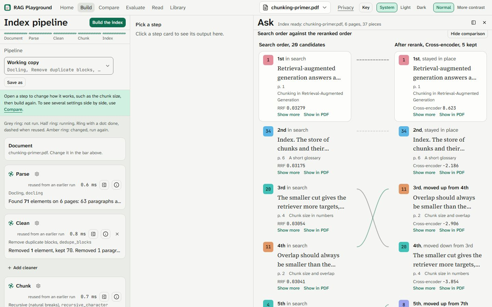

# RAG Playground

See why a RAG pipeline finds the answer, or misses it.

[Live demo](https://rag.codewithnk.com) | [Docs](https://github.com/nadeem4/rag-playground/tree/main/docs) | [GitHub](https://github.com/nadeem4/rag-playground)



RAG Playground runs a retrieval-augmented generation (RAG) pipeline on a PDF and shows
you every step: what the parser read, what the cleaners removed, where each chunk was cut,
what the search found and how the reranker moved it. Each step is a strategy you can swap,
so you can change one setting and see what it does.

## What you can do

- **Build.** Run the index pipeline one card at a time: Document, Parse, Clean, Chunk and
  Index. The Document bar at the top of Build, Compare and Evaluate picks the PDF, and the Ask panel docked
  beside the cards asks a question of the index you just built.
- **Ask.** Search with dense, keyword or hybrid retrieval, rewrite the question first if
  you like, and rerank the results. A slope shows how the reranker moved each piece. Chat
  writes an answer with checked citations.
- **Compare.** Run up to ten recipes of one step and read them side by side, or in an
  overview table when there are four or more. Save an experiment to open later, and put a
  winning recipe on Build with Use on Build.
- **Evaluate.** Score a pipeline against the sample's question set, or upload your own.
  Every miss says why it missed, with the sentence that answers the question and the
  pieces that came back instead.
- **Library.** Keep saved pipelines and experiments in one list, export them to a file
  (with the document, if you like) and import them in any browser.

## Try it online

Open the [live demo](https://rag.codewithnk.com). There is no sign in.

- Pick one of the bundled samples, or upload your own PDF. On the demo an upload can be
  up to 10 MB and 20 pages, a browser can keep 3 uploads at a time, and each upload is
  deleted 24 hours after it was made. Your uploads are private to your browser.
- Everything works without a key except chat answers, the LLM reranker and the LLM
  rewrite. For those, add your own Anthropic, OpenAI or OpenRouter key with the key button
  at the top right. The key stays in that browser tab's memory.

The [privacy page](https://rag.codewithnk.com/privacy) in the app says what
is kept, where and for how long. [docs/privacy.md](docs/privacy.md) says the same.

## Run it on your machine

You need [uv](https://docs.astral.sh/uv/) (it fetches Python 3.13 if you do not have it),
Node.js 22 or newer to build the web app once, and about 2 GB of disk for the models,
which download the first time they are used.

```bash
git clone https://github.com/nadeem4/rag-playground.git && cd rag-playground
cd web && npm install && npm run build && cd ..
uv run rag-playground
```

The server starts on http://127.0.0.1:8000 and opens your browser.

Or run it with Docker, from the cloned folder:

```bash
docker build -t rag-playground .
docker run --rm -p 127.0.0.1:8000:8000 -v rag-playground-data:/data rag-playground
```

Then open http://localhost:8000. The volume keeps your uploads, cached results and models.

Nothing expires locally; your files stay on your machine. You can upload larger PDFs,
use server keys from your environment or a `.env` file, and point chat at a local model
server such as Ollama. See [docs/deploy.md](docs/deploy.md) for the details.

## Run your own copy on Hugging Face

1. Open the [Space](https://huggingface.co/spaces/nadeem4nk/rag-playground) and choose
   **Duplicate this Space**.
2. In the copy's settings, set the variable `RAG_PLAYGROUND_DEMO` to `0` to lift the
   demo's limits, or leave it at `1`. With demo mode off:
   - uploads have no size, page or count limit, and nothing deletes them on a timer;
   - uploads are no longer private to one browser: every visitor sees every upload;
   - server keys from the Space's secrets are used;
   - custom OpenAI-compatible endpoints are allowed;
   - question sets you upload are kept beside their document;
   - the Dev menu shows in the header.
3. Optionally add `ANTHROPIC_API_KEY`, `OPENAI_API_KEY` or `OPENROUTER_API_KEY` as
   secrets. Server keys are used only with demo mode off. With demo mode on, only a key a
   visitor types into the app is used.

The free CPU Space works; Docling parsing is slow on it. With demo mode off the copy has
no sign in, so anyone with its address can use your keys: make the Space private if you
add them. See [docs/deploy.md](docs/deploy.md) for hardware, storage and updates.

## What's inside

Each step offers these strategies. The plain name is what the app shows; the code name is
the strategy's id in the API and in exported files.

| Step | Strategies you can pick |
|---|---|
| Document | A bundled sample, or Upload (`upload`) |
| Parse | Fast text (`pdfium`), Docling (`docling`) |
| Clean | Remove headers and footers (`header_footer_strip`), Remove duplicate blocks (`dedupe_blocks`), Remove matching text (`drop_matching`) |
| Chunk | Recursive, natural breaks (`recursive_character`), By heading (`markdown_header`), Fixed token count (`token_based`), By layout block (`layout_blocks`), By sentence (`sentence_window`) |
| Index | LanceDB (`lancedb`), with the Qwen3 or bge-small embedder |
| Query rewrite | None, PRF (`hybrid_rrf` with `query_expansion: prf`), LLM rewrite (`llm_rewrite`) |
| Search | Dense (`dense`), BM25 (`bm25`), Hybrid, RRF (`hybrid_rrf`) |
| Rerank | None, Cross-encoder (`cross_encoder`), MMR (`mmr`), LLM (`llm_rerank`) |
| Answer | Search (`search`), Chat with a model (`chat`), and Evaluate's check (`eval`) |

[docs/strategies.md](docs/strategies.md) explains each one and its settings.

## Learn more

- [Guide](docs/guide.md): every page of the app in detail.
- [Strategies](docs/strategies.md): every step and setting, and when to use each.
- [Models and keys](docs/models-and-keys.md): the models the app downloads, the chat
  providers, and what happens to a key.
- [Privacy](docs/privacy.md): what is kept in your browser and on the demo server, and
  for how long.
- [Deploy](docs/deploy.md): Docker, demo mode, variables, and running your own Space.
- [Architecture](docs/architecture.md): the pipeline graph, plugins, the cache and the
  run stream.
- [Contributing](CONTRIBUTING.md): development setup, tests, adding a strategy and
  cutting a release.

## License

MIT. See [LICENSE](LICENSE).
