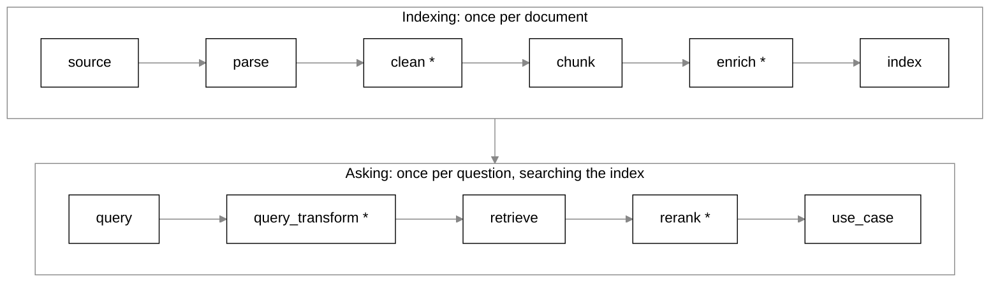

# Architecture

How RAG Playground is put together: a FastAPI server that runs pipeline graphs, plugins
for every strategy, a content-addressed cache, a stream of run events, and a React app
that talks to the API.

## Contents

- [The layout of the repo](#the-layout-of-the-repo)
- [The pipeline graph and its stages](#the-pipeline-graph-and-its-stages)
- [Plugins](#plugins)
- [Artifacts and the cache](#artifacts-and-the-cache)
- [The run stream](#the-run-stream)
- [How the web app talks to the API](#how-the-web-app-talks-to-the-api)

## The layout of the repo

```
core/        the engine: artifacts, transforms, the graph, the executor, the content-addressed store
providers/   embedding models, the embedding cache, chat model calls, and the custom endpoint check
plugins/     one module per strategy, grouped by stage
api/         the FastAPI server: registry, sources, runs and sweeps, artifacts, settings, demo mode
web/         the React app: Home, Build, Compare, Evaluate, Library, Read, inspectors
samples/     the bundled sample PDFs, each with its question set
scripts/     generate the samples, record the Home clips, publish the Space
tests/       pytest: unit, plugin contract, API and integration tests
```

## The pipeline graph and its stages

The engine has two ideas and no `Pipeline` class:

- **Artifact.** An immutable result, such as a parsed document, a chunk set, an index or a
  set of retrieval hits.
- **Transform.** A strategy that turns typed input artifacts into one output artifact.

A pipeline is a graph of transforms. Each node is one transform in one stage, with its
config, and each edge joins an output to an input port of the right type. The graph is
validated before it runs: an invalid graph is a 400 and an invalid node config a 422.



`*` marks a stackable stage: its input and output have the same type, so it can be added
several times, for example two cleaners in a row.

| Stage | What it is for | Strategies |
|---|---|---|
| `source` | The document you work on | `upload` |
| `query` | The question, and optionally the sentences that answer it | `text`, `llm_rewrite` |
| `parse` | Turns the PDF into text elements with their pages and positions | `pdfium`, `docling` |
| `clean` | Removes text that would pollute retrieval | `header_footer_strip`, `dedupe_blocks`, `drop_matching` |
| `chunk` | Cuts the text into the pieces that get indexed | `recursive_character`, `markdown_header`, `token_based`, `layout_blocks`, `sentence_window` |
| `enrich` | Adds context to chunks before indexing | none yet |
| `index` | Embeds the chunks and stores them for vector and keyword search | `lancedb` |
| `query_transform` | Rewrites the question before retrieval | none yet; the LLM rewrite is a `query` strategy |
| `retrieve` | Finds the candidates for the question | `dense`, `bm25`, `hybrid_rrf` |
| `rerank` | Picks the best few candidates | `mmr`, `cross_encoder`, `llm_rerank` |
| `use_case` | What you finally get | `search`, `chat`, `eval` |

[strategies.md](strategies.md) describes each strategy.

## Plugins

A strategy is one Python module under `plugins/<stage>/`. It defines a Pydantic config
model and a `Transform` subclass registered with `@register`. The class declares its
stage, its input ports, its output type, a `summary`, and an `explain(config)` that says
what these settings will do.

- `plugins/__init__.py` lists every module in `PLUGIN_MODULES`. A test fails if a plugin
  module exists but is not listed.
- `GET /api/registry` exports every transform with its summary, its config's JSON schema,
  and what it requires, provides and prefers. The web app builds every settings form from
  that schema, so a new strategy needs no frontend change.
- **Requires** is a hard lock: a retriever that needs a keyword index cannot run on an
  index built without one, the graph is rejected, and the app greys the option out.
- **Prefers** is a soft lock: the strategy still runs but falls back, with a sentence
  saying what happens instead, and the app tags it "Falls back".

[CONTRIBUTING.md](../CONTRIBUTING.md#adding-a-strategy) walks through adding one.

## Artifacts and the cache

An artifact's id is a hash of its recipe: the transform, the transform's version, its
fingerprint (such as the model it used), its config and the ids of its inputs, keyed by
input port. The id is known before the transform runs, so a node whose artifact is already
in the store is not run again.

That is what makes changing one setting cheap. Sweeping three chunkers over one parse is
one cached parse and three new chunk sets.

- **The store** (`core/storage.py`) keeps each artifact in its own folder under the
  artifacts folder. A write goes to a temp folder and is moved into place, and its
  `meta.json` is written last, so a crash never leaves an entry that looks finished.
  Nothing expires an entry; `DELETE /api/cache` clears the store.
- **The embedding cache** (`providers/embedding_cache.py`) keeps embeddings in SQLite at
  full width, keyed by model, revision and text, so the same piece is embedded once.
- **Uploads** are stored once under the sources folder, named by a fingerprint of their
  bytes.

## The run stream

The executor (`core/executor.py`) walks a validated graph, skips any node whose artifact
is cached, and emits an event for each step. A failure is data, not an exception: a
failed node is recorded with its traceback, the nodes below it are skipped, and unrelated
branches keep running.

A run is two requests:

1. `POST /api/runs` with the graph validates it, resolves the API keys from the request
   headers, starts the run in a worker thread and answers 202 with the run's id.
2. `GET /api/runs/{run_id}/events` streams the run's events as server-sent events:
   `run_started`, `node_started`, `node_skipped`, `node_failed`, `run_finished` or
   `run_cancelled`, then `stream_end`. A client that reconnects passes the last event id
   and gets the rest from there.

Compare uses `POST /api/sweeps` in the same way: one node, up to ten variants, with
`variant_started` and `variant_finished` events. `POST /api/runs/{run_id}/cancel` stops a
run.

The keys live only in the run's worker for its duration, and every event passes through a
filter that replaces a key with `[redacted]`.

## How the web app talks to the API

The web app is React, built with Vite into `web/dist`. FastAPI serves it, with a fallback
so every client route opens the app, and every API route lives under `/api`. The app uses
relative paths, so the same code works in development, where Vite on port 5173 proxies
`/api` to the server on port 8000.

- **Registry.** The app reads `GET /api/registry` to build the step cards and their forms.
- **Runs.** It posts the pipeline graph to `/api/runs` and opens an `EventSource` on the
  events, one per run.
- **Artifacts.** The inspectors read results with `GET /api/artifacts/{id}/payload`.
- **Sources.** Uploads, page images and the PDF itself come from `/api/sources`.
- **Settings.** `GET /api/settings/app` says whether demo mode is on and gives its limits.
- **Keys.** A key typed in the app is sent as a header on runs, sweeps and key checks.
- **State.** Saved pipelines, experiments and the working pipeline live in the browser's
  storage; see [privacy.md](privacy.md).

The app also has lessons, a guided walk through each step, but they are switched off
(`LESSONS_ENABLED` in `web/src/state/lessons.ts`) while they are reworked.
